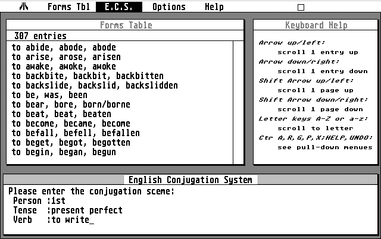

# English Conjugation System

This program, written in 1988 for the Atari ST using the GFA BASIC language, conjugates English verbs, e. g. finds out that the 1st person singular present tense of "to go" is "I go", or that the 3rd personal plural conditional II of "to see" is "they would have seen". It was written to demonstrate that English, in contrast to more complex languages like German or Latin, has very simple conjugation rules that can be implemented in a simple algorithm, with very few special cases needing to be covered beside the plain list of irregular verbs.



## Example Dialogs

Conjugate

```
Please enter the conjugation sceme:
 Person :1st
 Tense  :present perfect
 Verb   :to write
 
I have written
 
 Please push a key ...
  
Please enter the conjugation sceme:
 Person :3rd singular
 Tense  :future ii
 Verb   :to be
 
He/she/it will have been

 Please push a key ...
```

Principal forms

```
Enter present tense form of the word (CR to cancel) :to go
to go, went, gone              (irregular)

Enter present tense form of the word (CR to cancel) :hack
to hack, hacked, hacked        (regular)
```

## Features

* Conjugate any English verb in any of the following tenses: Present tense, past tense, present perfect, past perfect, future I and II, conditional I and II.
* Display the principal forms (present, past, perfect) for regular and irregular verbs.
* Optionally displays complete conjugation (all persons).
* Database with 300+ irregular verbs.
* User can add new irregular verbs to the database.
* User can remove verbs from the database.
* Automatically generates principal forms for regular verbs.
* Optional printer output.
* Online help.
* Complete GFA BASIC source code included.

Continuous forms ("ing-forms") are not supported.

## How To Run The Program

To run the program you need an Atari ST computer, or an emulator like Hatari or NoSTalgia. Copy all files from this repository onto a floppy or harddisk image, mount the image in the emulator, and double-click ECS.PRG in the GEM desktop.

Your emulator might allow you to mount a folder on your regular harddisk directly without having to make an image file. In Hatari, this is called  "GEMDOS drive".

## Files

* ECS.1ST: Documentation in 1st Word Plus format (in German).
* ECS.DOC: Brief introduction (in German).
* ECS.ECS: Irregular verbs database. Text file, first line is number of entries.
* ECS.LST: Source code in GFA BASIC.
* ECS.PRG: The executable.

Note: ECS.DOC is included in the original 1989 version for historical reasons. It offers you to receive printed documentation and latest version if you send 10 DM and a formatted floppy. For obvious reasons, this offer i‚s no longer valid.

## Author And Copyright

ECS was written by Wolfram Rösler and placed in the Public Domain in 1988.

## Links

* Atari ST: https://en.wikipedia.org/wiki/Atari_ST
* GFA BASIC: https://en.wikipedia.org/wiki/GFA_BASIC
* Atari ST emulator for macOS (used to create the screenshot above): http://hatari.tuxfamily.org
* Download image of a diskette that contains ECS, among other public domain programs: http://www.atariuptodate.de/en/1535/english-conjugation-system

---
*Wolfram Rösler • wolfram@roesler-ac.de • https://twitter.com/wolframroesler • https://github.com/wolframroesler*
